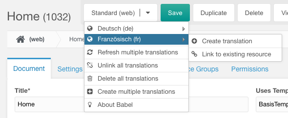
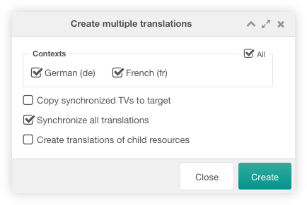
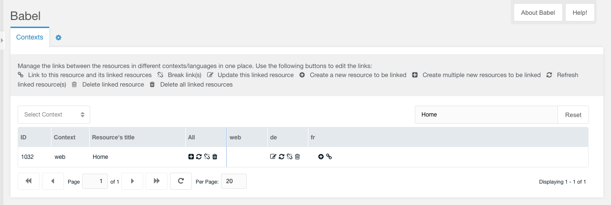

Babel contains a Babel Button, a custom manager page and two snippets.

## Babel Button

The Babel Button is located on the top of a resource form. With this button you
can create, link, update refresh and delete translated versions of the current
resource in different contexts.

Hover the button and create, link, update, unlink, refresh and delete the
translated versions of the current resource. You can also unlink and delete all
translations from this resource and create multiple translations in selectable
contexts with a menu entry.




If you create a link to an existing resource, the following window is displayed.
You must select the linked resource via the page tree on the left, by searching
for the page title or by entering the target ID directly.

If you enable 'Copy synchronized TVs to target', the synced template variables
(TVs) referenced in the system setting `babel.syncTvs` and the synced resource
fields referenced in the system setting `babel.syncFields` of all linked
resources are filled with the TV/field values of the current resource. The
system settings `babel.syncTvs` and `babel.syncFields` can be optionally be set
with according context settings. These context settings are synced in each
context group.

If you enable 'Synchronise all translations from the target', the language links
of the target resource are synced between the linked resources. The current
resource is also linked to the target resource and all linked resources.
Otherwise, only the current resource is linked to all linked resources of the
target resource and the link to the current resource is added to the links to
the target resource.


If you create a translation of the current resource in a selected context, the
following window is displayed.

If you enable 'Copy synchronized TVs to target', the synced template variables
(TVs) referenced in the system setting babel.syncTvs and the synced resource
fields referenced in the system setting babel.syncFields of the created resource
is filled with the TV/field values of the current resource.

If you enable 'Synchronise all translations', the language links of the current
resource are synced between the linked resources. The created translation is
linked to all linked resources. Otherwise, there is just a link created between
the current resource and the new created translation.

If you enable 'Create translations of child resources', the child resources of
the current resource are created and linked in the selected context.


If you create multiple translations of the current resource, the following
window is displayed. You must select the contexts into which the current
resource is not translated and for which you would like to create a translation.

If you enable 'Copy synchronized TVs to target', the synced template variables
(TVs) referenced in the system setting babel.syncTvs and the synced resource
fields referenced in the system setting babel.syncFields of all created resources
are filled with the TV/field values of the current resource.

If you enable 'Synchronise all translations', the language links of the current
resource are synced between the linked resources. All created translations are
linked to all linked resources. Otherwise, there is just a link created between
the current resource and the new created translations.

If you enable 'Create translations of child resources', the child resources of
the current resource are created and linked in the selected contexts.



## Custom Manager Page

The custom manager page contains two tabs.

### Contexts

In this tab you can manage the translated versions of a resource. The first
columns contain information of the source resource (ID, context and pagetitle)
and an `All` column to create multiple translations with a click on the
:fontawesome-solid-square-plus: icon, refresh all linked resources of the source
resource with a click on the :fontawesome-solid-rotate: icon, remove all links
to the source resource with a click on the :fontawesome-solid-link-slash: icon
or delete all linked resource of the source resource with a click on the
:fontawesome-solid-trash-can: icon. For each translatable context a grid column
is available with some icons. The following icons are available. 

For unlinked contexts:

- :fontawesome-solid-circle-plus: to create a new resource to be linked,
- :fontawesome-solid-link: to link to this resource and its linked resources

For linked contexts:

- :fontawesome-regular-pen-to-square: to update the linked resource
- :fontawesome-solid-rotate: to refresh the linked resource
- :fontawesome-solid-link-slash: to break the link
- :fontawesome-regular-trash-can: to delete the linked resource



### Settings

In this tab you can manage the system settings of Babel. The Tab is only shown
for users that have the babel_settings or settings permission.


## Snippets

Currently, there are two snippets available for Babel:

### BabelLinks

BabelLinks is a snippet that displays links to other languages (contexts) in the
frontend. It uses the following snippet properties:

| Property             | Description                                                                                                                                                       | Default      |
|----------------------|-------------------------------------------------------------------------------------------------------------------------------------------------------------------|--------------|
| activeCls            | CSS class for the active language link.                                                                                                                           | active       |
| ignoreSiteStatus     | Specifies whether the site_status is ignored (when the site is offline).                                                                                          | 0 (No)       |
| includeUnlinked      | Specifies whether the unlinked context are shown.                                                                                                                 | 0 (No)       |
| resourceId           | ID of resource of which links to translations should be displayed.                                                                                                | -            |
| restrictToGroup      | Restrict the contexts in the snippet output to the group the current context contains to. See `babel.contextKeys` system setting for defining context key groups. | 0 (No)       |
| showCurrent          | Specifies whether a link to the current language is shown.                                                                                                        | 0 (No)       |
| showUnpublished      | Specifies whether the unpublished translations are shown.                                                                                                         | 0 (No)       |
| sortby               | Context field to sort the results by. The default 'babel' means to sort by the order of the context keys in the babel.contextKeys system setting.                 | babel        |
| sortdir              | The direction to sort in.                                                                                                                                         | asc          |
| toArray              | Specifies whether the output is dumped as an array.                                                                                                               | 0 (No)       |
| toPlaceholder        | Specifies whether the output is dumped into the given placeholder's name.                                                                                         | -            |
| tpl                  | Chunk to display a language link.                                                                                                                                 | tplBabellink |
| useRequestProperties | Specifies whether the current request properties are used in the links to the translated resources.                                                               | 1 (Yes)      |
| wrapperTpl           | Chunk to wrap all language links. The placeholder for all links is [[+babelLinks]].                                                                               | -            |

You can use the following placeholders in the tpl chunk:

| Placeholder | Description                                                                                                                                                                                                     |
|-------------|-----------------------------------------------------------------------------------------------------------------------------------------------------------------------------------------------------------------|
| active      | If link points to a resource of the current active language (context) this placeholder is set to the active CSS class name specified by the activeCls property. Otherwise this placeholder is empty.            |
| contextKey  | Context key of the translated resource.                                                                                                                                                                         |
| contextName | Context name of the translated resource                                                                                                                                                                         |
| cultureKey  | Culture key of the translated resource (e.g en, de, fr oder es). You may use the babel lexicon to display the language's name: ```[[%babel.language_[[+cultureKey]]? &topic=`languages` &namespace=`babel`]]``` |
| id          | ID of tranlated resource. If no translation is available this placeholder is empty ('')                                                                                                                         |
| language    | Language description in the IANA language subtag registry                                                                                                                                                       |
| url         | Url to linked translation (or site_url of specific language if there is no translated resource available).                                                                                                      |

### BabelTranslation

The BabelTranslation snippets returns the ID of a translated resource in a
given context. It uses the following snippet properties:

| Property        | Description                                                                                                                                                                 | Default |
|-----------------|-----------------------------------------------------------------------------------------------------------------------------------------------------------------------------|---------|
| contextKey      | Key of context in which translated resource should be determined.                                                                                                           | -       |
| cultureKey      | Key of culture in which translated resource should be determined. Used only in case contextKey was not specified. If both omitted the snippet the currently set cultureKey. | -       |
| resourceId      | Comma-separated list of resource IDs of which a comma-separated list of translated resources in the contextKey/cultureKey should be determined.                             | -       |
| showUnpublished | Specifies whether the unpublished translations are shown.                                                                                                                   | 0 (No)  |
| toPlaceholder   | Specifies whether to dump the output into the given placeholder's name.                                                                                                     | -       |

## System Settings

Babel uses the following system settings in the namespace `babel`:

| Key                   | Name                         | Description                                                                                                                                                                         | Default             |
|-----------------------|------------------------------|-------------------------------------------------------------------------------------------------------------------------------------------------------------------------------------|---------------------|
| babel.babelTvName     | Babel TV Name                | Name of template variable (TV) in which Babel will store the links between multilingual resources. This TV will be maintained by Babel.                                             | babelLanguageLinks  |
| babel.contextKeys     | Context Keys                 | Comma-separated list of context keys which should be used to link multilingual resources. The comma-separated list can be divided into several context key groups using semicolons. | -                   |
| babel.debug           | Debug                        | Log debug information in the MODX error log.                                                                                                                                        | No                  |
| babel.displayChunk    | Button Chunk                 | Name of a chunk that is used for the text in the Babel button in each context.                                                                                                      | tplBabelContextMenu |
| babel.displayText     | Button Text                  | Text shown in the Babel button for each context. You can use the following values: `language`, `context`, `combination` or `chunk`.                                                 | language            |
| babel.restrictToGroup | Restrict To Group            | Restrict the contexts in the Babel button to the group the current context contains to. See `babel.contextKeys` system setting for defining context key groups.                     | Yes                 |
| babel.syncFields      | Synchronized Resource Fields | Comma-separated list of resource field names to be synchronised by Babel.                                                                                                           | -                   |
| babel.syncTvs         | Synchronized TVs             | Comma-separated list of template variables (TVs) IDs to be synchronised by Babel.                                                                                                   | -                   |

The button text in the Babel button can use the following values:

- language: the contexts are listed with the context language set in the
  cultureKey context setting.
- context: the contexts are listed with the context name.
- combination: the contexts are listed with the context name and the context
  language set in the cultureKey context setting.
- chunk: the contexts are listed with the chunk referenced in the system setting
  `babel.displayChunk`.

## Permissions

Babel has the following permissions for manager users:

| Permission     | Description                                                                     |                                                                                                                   
|----------------|---------------------------------------------------------------------------------|
| babel_settings | Allow a user to manage the Babel system settings the Babel custom manager page. |

The permission check is not executed for sudo users.

## Events

Babel invokes the following events which can be used in plugins:

### OnBabelDuplicate

This event is invoked on duplicating the resource in a new language context. It
uses the following parameters:

| Parameter          | Description                                 |                                                                                                                   
|--------------------|---------------------------------------------|
| context_key        | The context key of the duplicated resource. | 
| original_id        | The ID of the original resource.            | 
| original_resource  | The object of the original resource.        | 
| duplicate_id       | The ID of the duplicated resource.          | 
| duplicate_resource | The object of the duplicated resource.      | 

### OnBabelLink

This event is invoked on link the resource with a target resource. It
uses the following parameters:

| Parameter         | Description                             |                                                                                                                   
|-------------------|-----------------------------------------|
| context_key       | The context key of the linked resource. | 
| original_id       | The ID of the original resource.        | 
| original_resource | The object of the original resource.    | 
| target_id         | The ID of the linked resource.          |
| target_resource   | The object of the linked resource.      |

### OnBabelUnlink

This event is invoked on unlink the resource from a target resource. It
uses the following parameters:

| Parameter         | Description                               |                                                                                                                   
|-------------------|-------------------------------------------|
| context_key       | The context key of the unlinked resource. | 
| original_id       | The ID of the original resource.          | 
| original_resource | The object of the original resource.      | 
| target_id         | The ID of the unlinked resource.          |
| target_resource   | The object of the unlinked resource.      |

### OnBabelTVSynced

This event is invoked when TVs are synced and changed. It uses the following
parameters:

| Parameter   | Description                                                                                                   |
|-------------|---------------------------------------------------------------------------------------------------------------|
| tv_changes  | An array of the changes in the synced TVs. Each array element contains the values tvId, tvValue and targetId. |
| resource_id | The ID of the resource the changes are synced from.                                                           |

### OnBabelFieldSynced

This event is invoked when resource fields are synced and changed. It uses the following
parameters:

| Parameter    | Description                                                                                                                           |
|--------------|---------------------------------------------------------------------------------------------------------------------------------------|
| fieldChanges | An array of the changes in the synced resource fields. Each array element contains the values resourceId, resourceValue and linkedId. |
| resource_id  | The ID of the resource the changes are synced from.                                                                                   |
