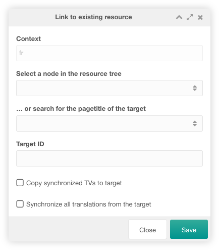

Babel contains a Babel Button, a custom manager page and two snippets.

## Babel Button

The Babel Button is located on the top of a resource form. With this button
you can create, link and update translated versions of the current resource in
different contexts.

Hover the button and create, link, update and unlink the translated versions of
the current resource.


If you create a link to an existing resource, the following window is displayed.
You must select the linked resource via the page tree on the left, by searching
for the page title or by entering the target ID directly.



## Custom Manager Page

The custom manager page contains two tabs.

### Contexts

In this tab you can manage the translated versions of a resource. The first
columns contain information of the source resource (ID, context and pagetitle)
and an `All` column to remove all links to the source resource with a click on
the :fontawesome-solid-link-slash: icon. For each translatable context a grid
column is available with two icons. The following icons are available depending
on the link state:

- :fontawesome-solid-circle-plus: to create a new resource to be linked, 
- :fontawesome-solid-link: to link to this resource and its linked resources
- :fontawesome-regular-pen-to-square: to update the linked resource
- :fontawesome-solid-link-slash: to break the link


### Settings

In this tab you can manage the system settings of Babel. The Tab is only shown
for users that have the babel_settings or settings permission.


## Snippets

Currently, there are two snippets available for Babel:

### BabelLinks

BabelLinks is a snippet that displays links to other languages (contexts) in the
frontend. It uses the following snippet properties:

| Property         | Description                                                                         | Default      |
|------------------|-------------------------------------------------------------------------------------|--------------|
| activeCls        | CSS class for the active language link.                                             | active       |
| ignoreSiteStatus | Flag whether to ignore the site_status (when the site is offline)                   | 0 (No)       |
| includeUnlinked  | Flag whether to show unlinked context.                                              | 0 (No)       |
| resourceId       | Id of resource of which links to translations should be displayed.                  | -            |
| showCurrent      | Flag whether to show a link to a translation of the current language.               | 0 (No)       |
| showUnpublished  | Flag whether to show unpublished translations.                                      | 0 (No)       |
| toArray          | Flag whether to dump the output as an array instead.                                | 0 (No)       |
| toPlaceholder    | Flag whether to dump the output into the given placeholder's name.                  | -            |
| tpl              | Chunk to display a language link.                                                   | tplBabellink |
| wrapperTpl       | Chunk to wrap all language links. The placeholder for all links is [[+babelLinks]]. | -            |

You can use the following placeholders in the tpl chunk:

| Placeholder | Description                                                                                                                                                                                                     |
|-------------|-----------------------------------------------------------------------------------------------------------------------------------------------------------------------------------------------------------------|
| active      | If link points to a resource of the current active language (context) this placeholder is set to the active CSS class name specified by the activeCls property. Otherwise this placeholder is empty.            |
| contextKey  | Context key of the translated resource.                                                                                                                                                                         |
| contextName | Context name of the translated resource                                                                                                                                                                         |
| cultureKey  | Culture key of the translated resource (e.g en, de, fr oder es). You may use the babel lexicon to display the language's name: ```[[%babel.language_[[+cultureKey]]? &topic=`languages` &namespace=`babel`]]``` |
| id          | ID of tranlated resource. If no translation is available this placeholder is empty ('')                                                                                                                         |
| language    | Language description in the IANA language subtag registry                                                                                                                                                       |
| url         | Url to linked translation (or site_url of specific language if there is no translated resource available).                                                                                                      |

### BabelTranslation

The BabelTranslation snippets returns the ID of a translated resource in a
given context. It uses the following snippet properties:

| Property        | Description                                                                                                                                                                 | Default |
|-----------------|-----------------------------------------------------------------------------------------------------------------------------------------------------------------------------|---------|
| contextKey      | Key of context in which translated resource should be determined.                                                                                                           | -       |
| cultureKey      | Key of culture in which translated resource should be determined. Used only in case contextKey was not specified. If both omitted the snippet the currently set cultureKey. | -       |
| resourceId      | ID of resource of which a translated resource should be determined.                                                                                                         | -       |
| showUnpublished | Flag whether to show unpublished translations.                                                                                                                              | 0 (No)  |

## System Settings

Babel uses the following system settings in the namespace `babel`:

| Key                   | Name              | Description                                                                                                                             | Default            |
|-----------------------|-------------------|-----------------------------------------------------------------------------------------------------------------------------------------|--------------------|
| babel.babelTvName     | Babel TV Name     | Name of template variable (TV) in which Babel will store the links between multilingual resources. This TV will be maintained by Babel. | babelLanguageLinks |
| babel.contextKeys     | Context Keys      | Comma separated list of context keys which should be used to link multilingual resources.                                               | -                  |
| babel.debug           | Debug             | Log debug information in the MODX error log.                                                                                            | No                 |
| babel.displayText     | Button Text       | Text shown in the Babel button for each context. It can use the following values: language, context, combination                        | language           |
| babel.restrictToGroup | Restrict To Group | Restrict the contexts in the Babel button to the group of the current context.                                                          | Yes                |
| babel.syncTvs         | Synchronized TVs  | Comma separated list of template variables (TVs) IDs to be synchronised by Babel.                                                       | -                  |

The button text in the Babel button can use the following values: 

- language: the contexts are listed with the context language set in the cultureKey context setting.
- context: the contexts are listed with the context name.
- combination: the contexts are listed with the context name and the context language set in the cultureKey context setting.

## Permissions

Babel has the following permissions for manager users:

| Permission     | Description                                                                     |                                                                                                                   
|----------------|---------------------------------------------------------------------------------|
| babel_settings | Allow a user to manage the Babel system settings the Babel custom manager page. |

The permission check is not executed for sudo users.
