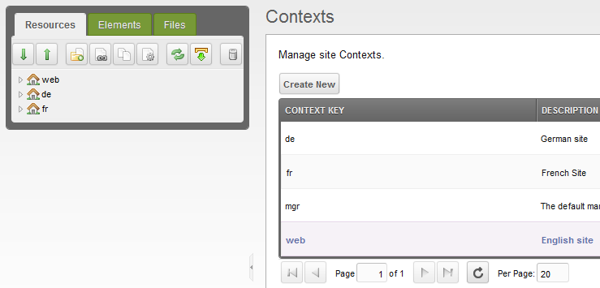
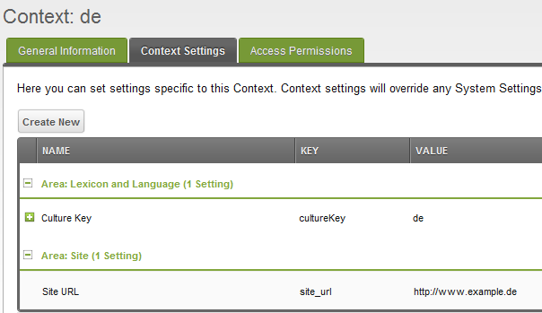
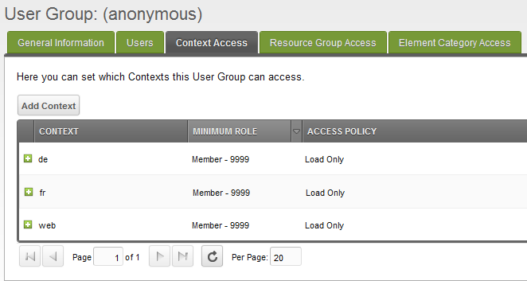

## Multilingual Websites with MODx and Babel

!!! caution "This is old!"

    This tutorial is a slightly modernized version of the [old blog
    entry](https://web.archive.org/web/20181010174256/http://www.multilingual-modx.com/blog/2011/multilingual-websites-with-modx-and-babel.html)
    on multilingual-modx.com which is available only in the WaybackMachine. It uses
    a routing plugin for easier maintaining the contexts. The links in the
    text are updated to actual or to WaybackMachine versions.

In the [official documentation](https://mikrobi.github.io/babel/) of the Babel
Extra I’ve only provided a short summary of how to set up your MODx contexts for
a multilingual website and referred to an outdated tutorial. Many Babel users
contacted me or posted an issue on [GitHub](https://github.com/Jako/Babel)
because they had some troubles with Babel. Most of these troubles were not
related to Babel itself but have been caused by setting up the contexts
incorrectly. With this small tutorial I want to support you in configuring your
multilingual websites with MODx and Babel.

!!! important

    I've described a more SEO-friendly approach in a [new
    article](tutorial-seo.md) which you may want to read, too.

First of all I want to thank [digital butter](https://www.butter.com.hk/) for
their great
[tutorial](https://web.archive.org/web/20150402201647/http://www.butter.com.hk/blog/posts/2010/08/internationalization-in-modx-revolution.html)
which explains how to set up a multilingual website with MODx. I referred to
their tutorial in the official documentation. However, since there have been
made some changes to the access control system of MODx you have to apply some
more steps to set up your multilingual website correctly.

In this article I’ll simply list all the steps necessary to set up your
multilingual site in a very basic way. I won’t provide as many details as the
guys from digital butter did. There are already some helpful resources available
on the web where you can obtain additional information:

- [Tutorial of digital butter](https://web.archive.org/web/20150402201647/http://www.butter.com.hk/blog/posts/2010/08/internationalization-in-modx-revolution.html)
- [Thread in the old MODX forum](https://forums.modx.com/index.php?action=thread&thread=52869&i=1)

### Step-by-Step Instructions

Ok. If you have worked through the documents listed above and installed a new
clean MODx environment you should be ready to set up your multilingual website.

I’ll go through all the necessary steps by configuring an example website which
will be available in three languages: _English_, _German_ and _French_. The English
site will be available via _www.​example.com_ the German site via _www.​example.de_
and the French one via _www.​example.fr_.

1. Create your contexts for each language: The default _web_ context will
   be used for the English site, a _de_ context for the German and a _fr_ context for
   the French site:

    

2. Configure language specific settings of all your contexts: `site_url` and `cultureKey`. 
   - **web context:** `site_url`: https://​www.​example.com, `cultureKey`: en
   - **de context:** `site_url`: https://​www.​example.de, `cultureKey`: de
   - **fr context:** `site_url`: https://​www.​example.fr, `cultureKey`: fr
   
    

3. Grant the _"Load Only"_ access policy for all your contexts to the _anonymous_
   group to let your users load the contexts.

    

4. Install a routing extra from the MODX repository, i.e. SmartRouting, xRouting
   or LangRouter via the MODX package management

5. Install the Babel Extra via package management.

Now you should be able to create documents and link translations via Babel in
your MODx manager. For information about how to use the MODx lexicon feauture
you may take a look at the [tutorial at digital
butter](https://web.archive.org/web/20150402201647/http://www.butter.com.hk/blog/posts/2010/08/internationalization-in-modx-revolution.html)
or [official documentation](https://mikrobi.github.io/babel/).

### Common Mistakes

In order to avoid mistakes during setting up your contexts here are some common
mistakes which have been made by users who requested my help:

- **Babel does not display the correct language of a context** 
  You may have forgotten to configure the cultureKey setting in the specific context. Babel uses this setting to determine the language of a context.

- **Babel does not display all links to translated documents in the front-end** 
  You may have forgotten to grant the "Load Only" access policy for your visitors to the specific contexts. Or you may have forgotten to flush the permissions.

- **The site is always displayed in the same language**
  Check your routing plugin and make sure it works properly.

### Further Help

!!! important

    I've described a more SEO-friendly approach in a new article which you may want to read, too.

If you’re still having problem regarding your multilingual site and Babel have a
look at the [closed issues](https://github.com/mikrobi/babel/issues/closed) on
GitHub. If you can’t find a solution there, feel free to [post a new
issue](https://github.com/mikrobi/babel/issues). We try to help you and
incorporate your feedback to improve Babel.
